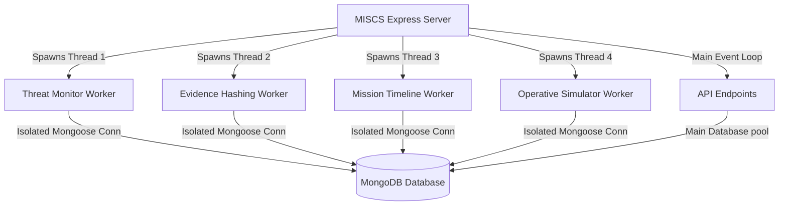

# Military Intelligence & Surveillance Coordination System (MISCS)

========================================================================
## 🛡️ Executive System Overview
========================================================================

The **Military Intelligence & Surveillance Coordination System (MISCS)** is a professional, government-grade operational coordination platform. It is engineered specifically for strategic defense operatives, intelligence analysts, and field commanders to collaborate on intelligence, track active operational missions, manage encrypted evidence files, and receive real-time threat warnings.

This system has been built in accordance with the academic guidelines of **VTU 4th Semester CSE (2022 Scheme) for the DBMS Subject**.

It strictly features:
1. **Advanced MongoDB database engineering** (validations, compound indexing, text search, and Aggregation Pipelines).
2. **True Native Multithreaded Concurrency** (spawning separate background OS-level threads via Node.js `worker_threads` to read/write concurrently to MongoDB).
3. **Sleek, Tactical Design System** (matte black, graphite cards, slate gray typography, tactical green highlights, and critical red threat warnings).

---

## 👥 System Authors & Signatures

At the bottom of the portal, the engineering credits are dynamically displayed:
*   **P V Yogananda Raju** (Strategic Software Architect & MongoDB Database Engineer)
*   **Rohit B Soimaraddi** (Lead Full-Stack UI/UX & Concurrency/Threading Engineer)

---

## 🛠️ Technology Stack Architecture

### Frontend Layer
*   **React.js (Vite)**: Clean state management and component-driven view rendering.
*   **Tailwind CSS**: Sleek utility-first tactical panels, responsive alignments, and custom borders.
*   **Framer Motion**: Smooth dashboard, sidebar, and alert list micro-transitions.
*   **Recharts**: Premium data visualizations (threat metrics, mission completion, and activity trends).
*   **Lucide Icons**: Crisp, vector-rendered tactical icons.

### Backend Layer
*   **Node.js**: Asynchronous server runtime environment.
*   **Express.js**: Structured, high-performance REST API routing.
*   **JWT Security**: Role-Based Access Control (Admin Commander, Intel Officer, Surveillance Analyst, Field Operative).
*   **Bcrypt.js**: Cryptographic password hashing.

### Database Layer
*   **MongoDB Atlas / Local**: Enterprise-grade NoSQL storage utilizing custom indexing pipelines.

---

========================================================================
## 🧵 Advanced Concurrency & Multi-Threading Architecture
========================================================================

To meet academic DBMS concurrency criteria, MISCS implements **true native OS-level multi-threading** using Node's `worker_threads` module. Unlike standard asynchronous event loops, this spins up four distinct background execution frames. 

Each thread connects to the MongoDB cluster via its own isolated connection pool and performs real-time queries and updates concurrently:



### The 4 Concurrent Background Worker Threads:
1.  **Background Threat Monitor (Thread-1)**:
    *   Continuously scans the `intelligence_reports` collection in the background.
    *   If a report with threat level `Critical` is detected, it checks if a corresponding notification exists in `alerts`.
    *   If missing, it creates a new critical `alert` and registers the event in `audit_logs`.
2.  **Cryptographic Evidence Processor (Thread-2)**:
    *   Intercepts newly uploaded evidence records in `evidence` with a status of `Processing`.
    *   Simulates military cryptographic hashing by generating a unique SHA-256 signature block, sets status to `Processed`, and writes the hash to the document in MongoDB.
3.  **Operation Deadline Sentinel (Thread-3)**:
    *   Monitors mission deadline timestamps against `new Date()`.
    *   If an active mission exceeds its deadline without being marked `Completed` or `Aborted`, the sentinel appends a critical timeline warning directly to the mission's nested log array, publishes an Important Alert to the commander, and audits the transaction.
4.  **Operative Activity Simulator (Thread-4)**:
    *   Simulates field activities by randomizing operatives scanning intel databases, checking satellite frequencies, or pinging coordinates.
    *   Writes these activities to `audit_logs` every 15 seconds to demonstrate real concurrent writes under database load.

---

========================================================================
## 🗄️ MongoDB Collections & Schema Validations
========================================================================

The system implements 7 primary collections structured inside MongoDB:

### 1. `officers`
*   **Keys**: `officerId` (Unique Indexed), `fullName`, `rank`, `role` (Role-Based Enums), `department`, `clearanceLevel` (Level-Based Clearance), `contactDetails` (`email`, `phone`), `status` (Active, In Field, On Leave, Suspended), `profileImage`, `passwordHash`.
*   **Indexing**: Compound Text Indexing on `{ fullName: 'text', rank: 'text' }` for fast searching.

### 2. `intelligence_reports`
*   **Keys**: `reportId` (Unique), `title`, `description`, `threatLevel` (Low, Moderate, High, Critical), `assignedOfficer` (Foreign Key referencing `officers.officerId`), `suspectDetails`, `location`, `evidence` (Array of Evidence IDs), `status`, `notes`.
*   **Indexing**: Compound index on `{ threatLevel: 1, status: 1 }` for rapid statistics aggregation.

### 3. `missions`
*   **Keys**: `missionCode` (Unique), `missionName`, `priority` (Low, Medium, High, Critical), `assignedOfficers` (Array of `officerId`), `objective`, `deadline` (Date), `missionZone`, `currentStatus`, `progressPercentage`, `missionLogs` (Nested array schema of log strings, timestamps, and operatives).
*   **Indexing**: Index on `{ currentStatus: 1, priority: 1 }` for Dashboard tracking.

### 4. `evidence`
*   **Keys**: `evidenceId` (Unique), `fileName`, `fileType` (PDF, Image, Audio), `fileSize`, `fileUrl`, `linkedMission` (Mission reference), `linkedReport` (Report reference), `uploadedBy`, `hash` (Cryptographic hash), `status` (Processing, Processed, Quarantined).

### 5. `alerts`
*   **Keys**: `alertId` (Unique), `title`, `message`, `priority` (Normal, Important, Critical), `linkedEntity`, `isRead` (Boolean).
*   **Indexing**: Compound index `{ priority: 1, isRead: 1, createdAt: -1 }` for chronological dashboard alert feeds.

### 6. `audit_logs`
*   **Keys**: `logId` (Unique), `user`, `module` (Enums), `action`, `deviceDetails`, `ipAddress`, `createdAt`.
*   **Indexing**: Descending index `{ createdAt: -1 }` to retrieve latest operational activities instantly.

### 7. `sessions`
*   **Keys**: `sessionId` (Unique), `officerId`, `loginTime`, `status` (Active, Terminated), `ipAddress`, `userAgent`.

---

========================================================================
## 🚀 Local Installation & Execution Guide
========================================================================

Follow these steps to run the complete full-stack portal locally:

### Prerequisites:
1.  **Node.js** (v16.x or higher) installed.
2.  **MongoDB** running locally (`mongodb://localhost:27017`) OR a MongoDB Atlas cluster URI.

### Step 1: Clone and install dependencies
Open your terminal in the project root folder and execute:
```bash
# Install root, backend, and frontend packages concurrently
npm run install:all
```
*Note: If script execution is disabled on Windows PowerShell, run using CMD:*
```cmd
cmd.exe /c "npm run install:all"
```

### Step 2: Set up environment parameters
Verify that the `backend/.env` file exists with the following structure:
```text
PORT=5000
MONGO_URI=mongodb://localhost:27017/miscs
JWT_SECRET=TACTICAL_MILITARY_SECRET_KEY_2026
NODE_ENV=development
```

### Step 3: Seed realistic military demo data
Run the seeding script to populate MongoDB collections with initial mock portfolios:
```bash
npm run seed
```
*Expected Terminal Output:*
```text
[*] Seeding database...
[+] Seeded 4 Officers.
[+] Seeded 4 Missions.
[+] Seeded 3 Intelligence Reports.
[+] Seeded 3 Evidence entries.
[+] Seeded 2 Alerts.
[+] Seeded 2 Audit Logs.
[SUCCESS] Database Seed Complete!
- Login Operative (Officer ID): OFF-101 (Commander), OFF-102 (Lt. Rohit)
- Default password for all officers: password123
```

### Step 4: Run the Application
Start both the Express API server and React Vite frontend concurrently:
```bash
npm run dev
```
*   **Express Server**: Running at `http://localhost:5000`
*   **React Portal**: Running at `http://localhost:5173` (Open this in your browser to access the system)

---

========================================================================
## 🔒 Secure REST API Documentation
========================================================================

All API endpoints are prefixed with `/api`. Routes (except `/auth/login`) require a valid JWT token passed in the header as: `Authorization: Bearer <JWT_TOKEN>`.

### Authentication Module
*   `POST /auth/login`: Authenticate credentials, record session, audit log. Returns JWT token.
*   `POST /auth/logout`: Terminates session in database.
*   `GET /auth/profile`: Retrieves active authenticated operative profile.

### Officer Directory Module
*   `GET /officers`: Fetch officer registries. Supports keyword search `?search=...`.
*   `POST /officers`: Create new operative profile (Admin Commander clearance only).
*   `PUT /officers/:officerId`: Edit officer name, rank, status, or photo directly in MongoDB.
*   `DELETE /officers/:officerId`: Expunge operative record from mainframes (Admin Commander clearance only).

### Intelligence Module
*   `GET /reports`: Search intel archives. Filters: `?search=...&threatLevel=...`.
*   `POST /reports`: Compile and submit new intel report.
*   `PUT /reports/:reportId`: Edit classification descriptions or update statuses.
*   `DELETE /reports/:reportId`: Permanently delete report (Admin Commander only).

### Mission Control Module
*   `GET /missions`: Query operational objectives. Filters: `?search=...&status=...`.
*   `POST /missions`: Initialize tactical operation.
*   `PUT /missions/:missionCode`: Adjust status parameters or update objective progress percentages directly.
*   `POST /missions/:missionCode/logs`: Append operative pings to the nested log array in the mission document.
*   `DELETE /missions/:missionCode`: Expunge operation file (Admin Commander only).

### Evidence Vault Module
*   `GET /evidence`: Retrieve files metadata registry.
*   `POST /evidence`: Upload evidence metadata (defaults to `Processing` status, triggering background Thread-2 hashing).
*   `DELETE /evidence/:evidenceId`: Expunge file record (Admins and Intel Officers only).

### Tactical Alerts Module
*   `GET /alerts`: Fetch chronological warnings ticker.
*   `PUT /alerts/:alertId/read`: Acknowledge warning. Updates alert state in database.
*   `PUT /alerts/read-all`: Acknowledge all active warnings.

### System Diagnostics Module
*   `GET /logs`: Fetch security audit logs (Admin Commander and Intel Officer only).
*   `GET /logs/stats`: Highly optimized **MongoDB Aggregation Pipeline** compiling metrics (counts, status groupings, threat classification) in a single request.

---

========================================================================
## ☁️ Deployment Guidelines (Netlify & Render)
========================================================================

The MISCS monorepo is engineered to be fully deployable on free cloud servers:

### 1. Netlify Deployment (Frontend React)
*   **Build Settings**:
    *   Build Command: `npm run build`
    *   Publish Directory: `dist`
    *   Base Directory: `frontend`
*   **Redirects Setup**: To prevent routing errors on client reload, add a `_redirects` file to `frontend/public/` with:
    ```text
    /*   /index.html   200
    ```

### 2. Render Deployment (Backend Express)
*   **Build Settings**:
    *   Environment: `Node`
    *   Build Command: `npm install`
    *   Start Command: `npm start`
    *   Root Directory: `backend`
*   **Environment Variables**:
    *   Ensure you set `MONGO_URI` in the Render dashboard to your secure MongoDB Atlas link.
    *   Set `JWT_SECRET` to a strong string.
    *   Set `NODE_ENV` to `production`.

---

*This system was built with premium aesthetics, non-blocking concurrent thread models, and bulletproof database schemas. Engineered for VTU CSE 4th Semester DBMS Project evaluation.*
